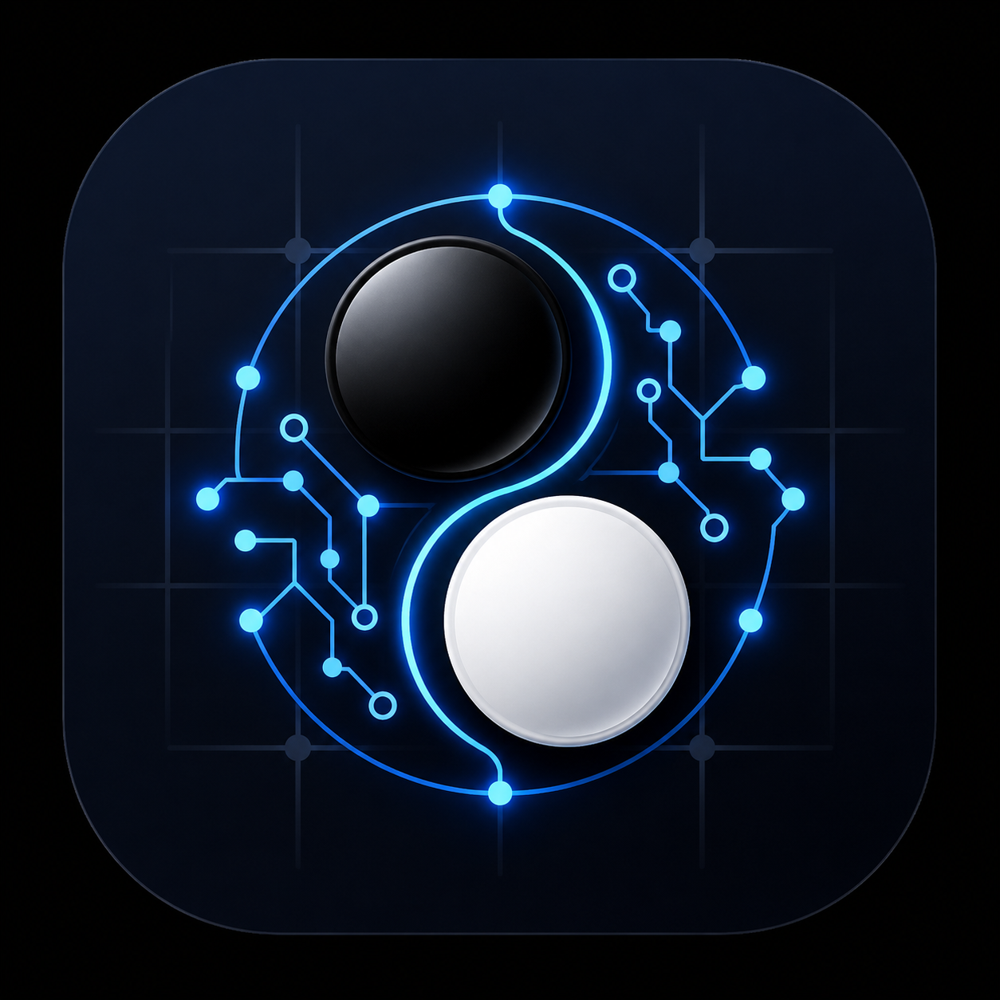

<p align="center">
  
</p>

<h1 align="center">성빈이와 바둑하기</h1>

<p align="center">
  <strong>표준 바둑 규칙 기반 모바일 AI 대국 앱</strong><br/>
  바둑 + 오목을 한 앱에서. 누구나 어디서든 한 판.
</p>

<p align="center">
  <a href="https://badook-d7a9.vercel.app">Live Demo</a>
</p>

---

## 주요 기능

### 바둑
- **표준 규칙** &mdash; 착수, 활로, 따냄, 패(Ko), 자충수 금지, 계가(영역+잡은돌)
- **덤 6.5점** (한국기원 기준)
- **바둑판 크기** &mdash; 9x9 / 13x13 / 19x19
- **사석 처리** &mdash; 대국 종료 후 죽은 돌 수동 제거 단계

### 오목
- **15x15** 기본 오목
- **5목 판정** &mdash; 가로, 세로, 대각선

### AI 대국
| 난이도 | 설명 |
|--------|------|
| **하** | 입문자용. 랜덤 + 기본 판단 |
| **중** | 평가 함수 기반 전략 |
| **상** | 미니맥스 2수 앞 탐색 |

### 편의 기능
- **무르기** &mdash; 직전 수(내 수 + AI 수) 되돌리기
- **착수 확인** &mdash; 터치 → 미리보기 → 확인 2단계 (옵션)
- **효과음** &mdash; 돌 놓기, 따냄, 패스, 종료 사운드 (Web Audio API)
- **타이머** &mdash; 5/10/20/30분 선택. 시간 초과 시 패배
- **대국 리플레이** &mdash; 끝난 게임을 1수씩 되짚어보기
- **대국 기록** &mdash; 승/패/무 전적, 승률, 기록 목록
- **PWA** &mdash; 홈 화면에 추가하면 앱처럼 사용 가능

---

## 기술 스택

| 영역 | 기술 |
|------|------|
| 프레임워크 | Next.js (App Router) |
| 언어 | TypeScript |
| 스타일링 | Tailwind CSS |
| 렌더링 | HTML5 Canvas |
| 사운드 | Web Audio API |
| 저장 | localStorage |
| DB (옵션) | Supabase |
| 배포 | Vercel |

---

## 로컬 실행

```bash
git clone https://github.com/yehsb123/BADOOK.git
cd BADOOK
npm install
npm run dev
```

`http://localhost:3000` 에서 확인

---

## 배포

GitHub에 push하면 Vercel이 자동 배포합니다.

### Supabase 연동 (선택)

1. Supabase 프로젝트 생성
2. `supabase-schema.sql`을 SQL Editor에서 실행
3. Vercel 환경변수 설정:
   - `NEXT_PUBLIC_SUPABASE_URL`
   - `NEXT_PUBLIC_SUPABASE_ANON_KEY`

---

## 프로젝트 구조

```
src/
├── app/
│   ├── page.tsx          # 메인 (메뉴 + 게임 + 오목)
│   ├── layout.tsx        # 레이아웃 + 메타데이터
│   └── globals.css       # 전역 스타일
├── components/
│   ├── GoBoard.tsx       # 바둑판 Canvas 렌더러
│   ├── GamePanel.tsx     # 점수판 + 게임 컨트롤
│   ├── GameHistory.tsx   # 대국 기록 뷰어
│   └── GameReplay.tsx    # 리플레이 뷰어
└── lib/
    ├── game-engine.ts    # 바둑 규칙 엔진
    ├── ai-engine.ts      # 바둑 AI (하/중/상)
    ├── omok-engine.ts    # 오목 규칙 + AI
    ├── sounds.ts         # Web Audio 효과음
    ├── history.ts        # localStorage 기록
    └── supabase.ts       # Supabase 클라이언트
```

---

## 라이선스

MIT
